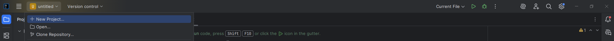
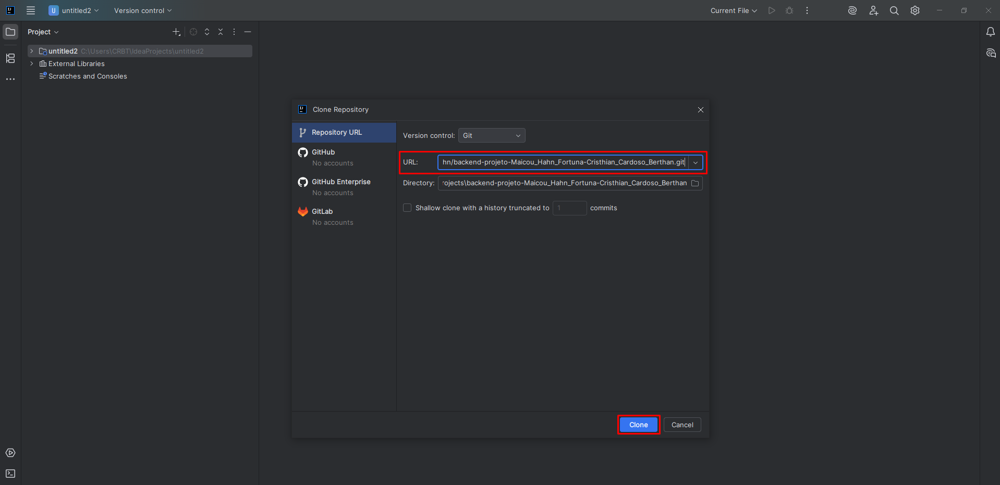
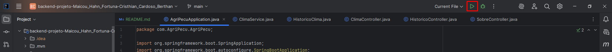
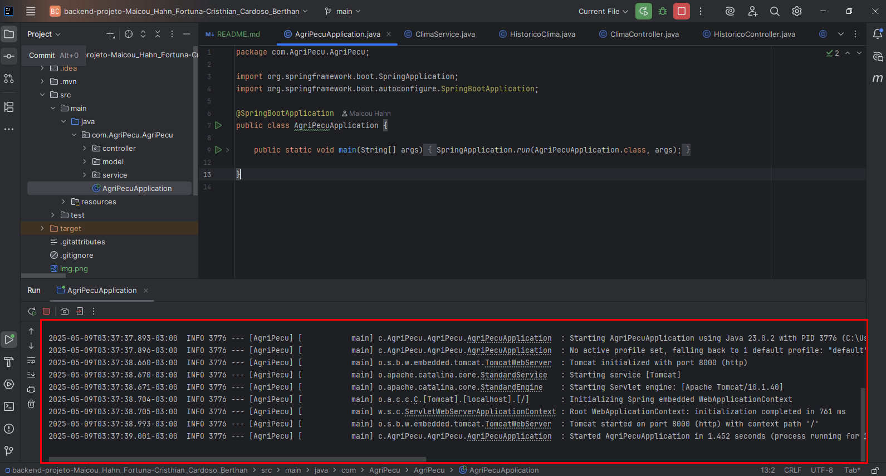

# Projeto Consulta de Clima e Tempo para Agropecuária

## Descrição

O projeto é um web service desenvolvido em Java Spring Boot que realiza o consumo de uma API open source trazendo dados referentes ao clima e o tempo, favorecendo os produtores rurais que exercem atividades de agricultura e pecuária. 

## Endpoints
- `POST /clima` - Retorna dados referente ao clima e o tempo.
- `POST /avaliar` - Retorna dados referente ao clima da cidade correspondente e traz sugestões da atividade favorável com base no clima atual.
- `GET /sobre` - Informações sobre os autores do projeto.
- `GET /histórico` - Histórico de todas as consultas e requisições realizadas.

## Instruções de como executar o projeto

### Pré requisitos:

- IDE que seja compatível com Spring, como por exemplo o InteliJJ IDEA, Spring Tool Suite, Eclipse ou a versão gratuita do IntelliJ Comumunity Edition.
- JDK (Java Development Kit) com versão 8 ou superior instalado.
- Maven versão 3.3.2+ para realizar a gestão das dependências.
- Ferramenta para executar **requisições HTTP** (GET, POST, PUT, DELETE). Recomenda-se o `Postman` ou o `Insomnia`.

### Instruções de uso:
1. Abra a IDEA (neste exemplo, utiliza-se o `InteliJJ Community Edition`)
2. Siga o caminho conforme imagem abaixo:



3. Clonar repositório e preencher a seguinte URL:

`https://github.com/MaicouHahn/backend-projeto-Maicou_Hahn_Fortuna-Cristhian_Cardoso_Berthan.git`


4. Abrir a camada da aplicação chamada `AgriPecuApplica`
5. Inicializar a aplicação através do botão `Run`



6. Aplicação inicializada com sucesso.



7. Abra a ferramenta para executar as requisições HTTP (neste exemplo, utiliza-se o `Postman`)


## 1º Exemplo de uso
- **POST ``/clima``**
```json
{
  "cidade": "Criciúma",
  "tipo": "agricultura",
  "atividade": "colheita"
}
```
- **Retorno**
```json
{
  "cidade": "Criciúma",
  "condicoesAtuais": "nublado, 23.75°C",
  "recomendacao": "Clima ideal para colheita. Aproveite o tempo seco."
}
```

## 2º Exemplo de uso
- **POST ``/avaliar``**
```json
{
  "cidade": "Criciúma"
}
```
- **Retorno**
```json
{
  "cidade": "Criciúma",
  "clima": "nublado, 24.31°C",
  "avaliacao": "Clima favorável para atividades no campo."
}
```

## 3º Exemplo de uso
- **GET ``/sobre``**
```json
{}
```
- **Retorno**
```json
{
  "integrantes": ["Maicou Hahn Fortuna","Cristhian Cardoso Bertan"],
  "nome_projeto": "AgriPecu"
}
```

## 4º Exemplo de uso
- **GET ``/histórico``**
```json
{}
```
- **Retorno**
```json
[
  {
    "cidade": "Criciúma",
    "tipo": null,
    "atividade": null,
    "resposta": null,
    "clima": "nublado, 24.31°C",
    "avaliacao": "Clima favorável para atividades no campo."
  },
  {
    "cidade": "Criciúma",
    "tipo": "agricultura",
    "atividade": "colheita",
    "resposta": "Clima ideal para colheita. Aproveite o tempo seco.",
    "clima": null,
    "avaliacao": null
  }
]
```
